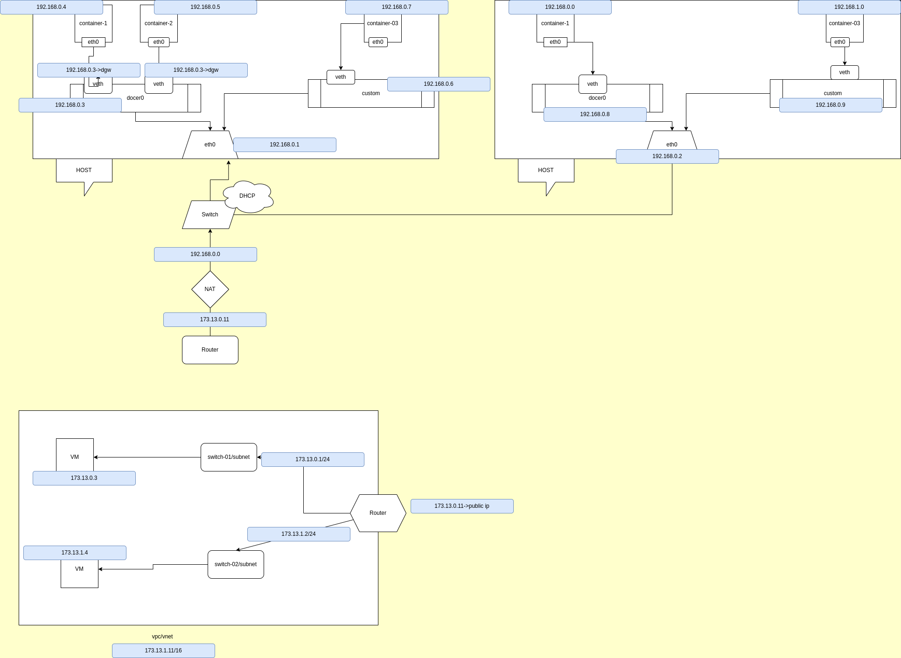

# Run docer container and run command inside it
docker container run ubuntu cat /etc/0s-release

# See how many images you have?

docker images ls

# See how many docker container ?

docker container ls -a

# Remove a container ?

docker container rm container_id

# Remove multiple container ?
 docker container rm container_id container_id

# Start a container?
docker container start container_id

# Stop a container ?
docker container stop id

# Run a container in background?

docker container run -d ubuntu sleep 30

# Go inside a container?

docker container run -it ubuntu /bin/bash

# Check os realease?
cat /ect/os-release

 # You can also exit from a container without killing it
ctrl p  q

# Remove all container in one command?
docker container rm $(docker container ls -aq)

# How to inspect or get ip address of a container?
 docker container inspect id | less

# Port mapping command ?
 docker container run -d  -p 3600:80 --name my_nginx  nginx

# How to check how many ports running on my machine?

netstat -nltp

# Go inside a container ?

docker container exec -it id /bin/bash

# Rename a container name

 docker container rename id new_name

# Restart a container?

docker container restart id

# Check logs of a container?
docker container logs id

# How to check how many process running on a container?

docker container top id
ps -aux

# How to see all my container using how many ram
docker container stats

# Attach a container inforgrounf?

docker container attach id

# Kill a container?

docker container kill id

# Waiting for exit status of a container?

docker container wait id

# Pause a conatiner ?
docker container pause id

# Unpause a conatainer?

docker container unpause

# Delete all stopped container?

dockar container prune -f

# Check port mapping of container?

docker container port name_of _container

# Docker create command just create a container 
 docker container create ubuntu  sleep 60

# Check file system change of a container ?
 docker container diff id ->(C means created  ,D means deleted,A means add  )

# Set watch command to a cmd

watch 'docker container diff id'

# Copy a file to a particular container

docker container cp test/  id:/tmp/

here test/ host machine path and :/tmp is container path

# Go inside a detach container?
 docker container attatch id

# Export a docker container ?

docker container export id>my_exported.tar

Or docker container export id -o my_exported_container

# How to import exported container?

docker image import my_exported_container my_image

# How to make image from a running container?

docker container commit --author "Kibria" -m "this is test commit id new_name

# How to pull a specific image?

docker pull ubuntu:14.04

# Give a tag to a iamge

docker image tag hub.docker.com/my_id/image_name 
docker login
docker push name_of_image

# Remove image 
docker rm image name

docker image prune(delete unused iamage)

# Save a image 

docker image save name> new_name.tar

# Load from tar file
docker image load < logstash.tar

Diff between save and export is save take all layer all tag on the tar file but export dont take parent layers

export make an image without volume in the new tar file

#  We can persist data using two method like volumes or bind mount

 docker volum ls

# Enter to mysql

docker container run -d --name mysql -e MYSQL_ALLOW_EMPTY_PASSWORD=true mysql

# Inspect mysql

docker volum inspect mysql | less

# In my local host
 
 cd /var/lib/docker/id

# Enter to mysql
docker container exec -it mysql /bin/bash

mysql
create dabase example

And after removing container if we attach it to a new container then example databse will be there

# Create a new container with existing volum

docker container run -it -v id:/var/lib/mysql mysql
docker container run -d --name xyz -v abc:/var/lib/mysql -e MYSQL_ALLOW_EMPTY_PASSWORD=true mysql
And if abc volum will be created if not created

and entering on that previous database will be seen there

# List all volume

docker volume ls

# Create new volume
docker volume create my_volume

# Remove volume

docker volume rm name_of_the_volum

docker volume prune

# Lets mount our host machine file folder using bind mount

docker container run -it -v hostmachinepath:/tmp/test/ ubuntu:14.04  bash 

we have to give full path of host maching and we can get that from bellow command

# To get a file path
pwd

Or docker container run -it -v $(pwd) :/tmp/test/ ubuntu:14.04 bash

Or docker container run -it --mount type=bind ,source=$(pwd), target=/tmp/test ubuntu:14.04 bash

# Inspect network
docker network inspect  bridge(Default network)

# Create network driver bridge
docker network create -d bridge test

docker container run -it --network test ubuntu
docker container run --network=test -itd -P nginx

If we attach a custom network then its dns enabled automatically

Here all files are isolated but the network are not isolated

we cant create multipe host network

# Container connect to multiple network ?
 docker network connect test id

# If we delete or disconnect ?
docker network disconnect test id

# Remove a network ?
docker netwrok prune
docker netwrok rm name

